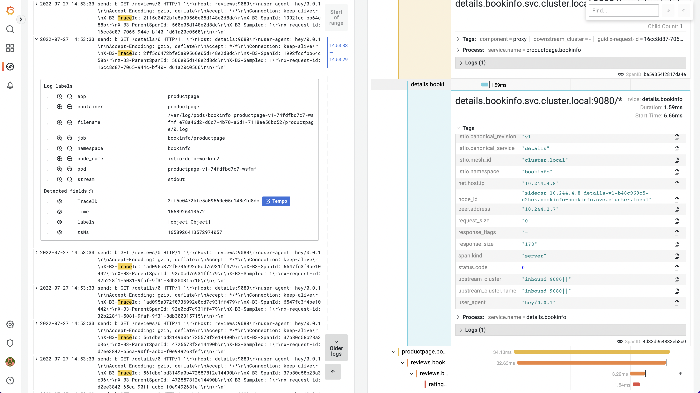

# Demystifying istio

## What does this include?

A [KIND](https://kind.sigs.k8s.io/) based Kubernetes cluster on your notebook with:
- Istio configured with Logging&Tracing (100% of the requests)
- Grafana Tempo
- Grafana Loki
- Prometheus
- Some example applications

## Setting up the environment

> Note: this requires an x86_64 kubernetes cluster until istio supports ARM64. [Colima](https://github.com/abiosoft/colima) as a docker runtime works great.

> for M1 users: `colima start --cpu=8 -l --network-address --arch=x86_64 --memory=10` (yes, you want to pass those resources!)

- Installing the latest version of Golang (e.g. on MacOS `brew install go`)
- run `make bootstrap` which creates a [KIND](https://kind.sigs.k8s.io/) cluster and installs istio
- Create the bookinfo application with `kubectl apply -k istio-examples/bookinfo`

## Accessing services

- [Grafana](http://grafana.127.0.0.1.nip.io:8080)
- [Bookinfo](http://bookinfo.127.0.0.1.nip.io:8080/productpage)


## Finding Traces

Once the bookinfo application is deployed and has been accessed, traces should've been ingested into the system.
Application logs can be filtered with [{namespace="bookinfo", container!~"istio-.+"} |= "Trace"](http://grafana.127.0.0.1.nip.io:8080/explore?orgId=1&left=%7B%22datasource%22:%22Loki%22,%22queries%22:%5B%7B%22refId%22:%22A%22,%22expr%22:%22%7Bnamespace%3D%5C%22bookinfo%5C%22,%20container!~%5C%22istio-.%2B%5C%22%7D%20%7C%3D%20%5C%22Trace%5C%22%22%7D%5D,%22range%22:%7B%22from%22:%22now-1h%22,%23to%22:%22now%22%7D%7D).
Expanding a log line reveals a button to open the trace in the famous waterfall view.



## Generating traffic
The [hey](https://github.com/rakyll/hey) tool is easy to use and gives basic statistics on what's going on:

```
xvzf@ubuntu2204 ~/demystifying-istio (git)-[main] % hey -c 2 -n 50 http://bookinfo.127.0.0.1.nip.io:8080/productpage

Summary:
  Total:	1.4525 secs
  Slowest:	0.1018 secs
  Fastest:	0.0270 secs
  Average:	0.0573 secs
  Requests/sec:	34.4227

  Total data:	247620 bytes
  Size/request:	4952 bytes

Response time histogram:
  0.027 [1]	|■■■
  0.034 [2]	|■■■■■■
  0.042 [8]	|■■■■■■■■■■■■■■■■■■■■■■■■■
  0.049 [3]	|■■■■■■■■■
  0.057 [11]	|■■■■■■■■■■■■■■■■■■■■■■■■■■■■■■■■■■
  0.064 [13]	|■■■■■■■■■■■■■■■■■■■■■■■■■■■■■■■■■■■■■■■■
  0.072 [5]	|■■■■■■■■■■■■■■■
  0.079 [3]	|■■■■■■■■■
  0.087 [1]	|■■■
  0.094 [1]	|■■■
  0.102 [2]	|■■■■■■


Latency distribution:
  10% in 0.0384 secs
  25% in 0.0481 secs
  50% in 0.0572 secs
  75% in 0.0646 secs
  90% in 0.0761 secs
  95% in 0.0969 secs
  0% in 0.0000 secs

Details (average, fastest, slowest):
  DNS+dialup:	0.0003 secs, 0.0270 secs, 0.1018 secs
  DNS-lookup:	0.0003 secs, 0.0000 secs, 0.0074 secs
  req write:	0.0000 secs, 0.0000 secs, 0.0002 secs
  resp wait:	0.0566 secs, 0.0268 secs, 0.1016 secs
  resp read:	0.0003 secs, 0.0001 secs, 0.0061 secs

Status code distribution:
  [200]	50 responses
```
